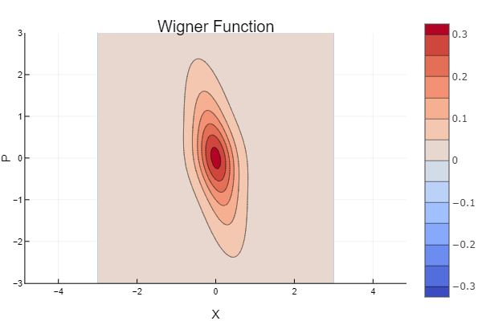
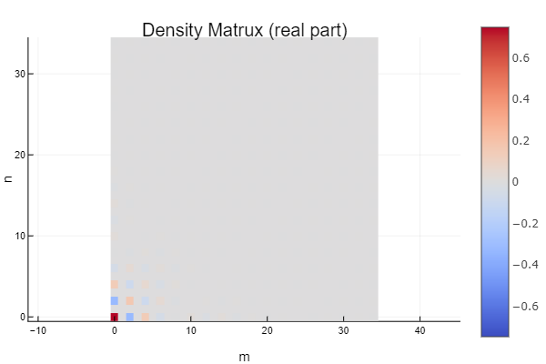
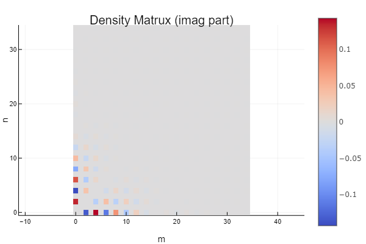

# QuantumStatePlots

[](https://foldfelis-qo.github.io/QuantumStatePlots.jl/stable)
[](https://foldfelis-qo.github.io/QuantumStatePlots.jl/dev)
[](https://github.com/foldfelis-QO/QuantumStatePlots.jl/actions/workflows/CI.yml)
[](https://codecov.io/gh/foldfelis-QO/QuantumStatePlots.jl)

## Example

The quantum state and its wigner function:

```julia
julia> using QuantumStateBase

julia> ρ = SqueezedState(0.8, π/8, Matrix, dim=100)

julia> w = wigner(ρ, LinRange(-3, 3, 101), LinRange(-3, 3, 101));
```

### Wigner function

**Surface**

```julia
julia> using QuantumStatePlots, Plots

julia> surface(w)
```


**Heatmap**

```julia
julia> using QuantumStatePlots, Plots

julia> heatmap(w)
```


**Contour**

```julia
julia> using QuantumStatePlots, Plots

julia> contour(w)
```



### Density matrix

**Real part**

```julia
julia> using QuantumStatePlots, Plots

julia> plot_real(ρ, 35)
```



**Imag part**

```julia
julia> using QuantumStatePlots, Plots

julia> plot_imag(ρ, 35)
```



## Reference

* [Quantum mechanics as a statistical theory](https://doi.org/10.1017/S0305004100000487)
