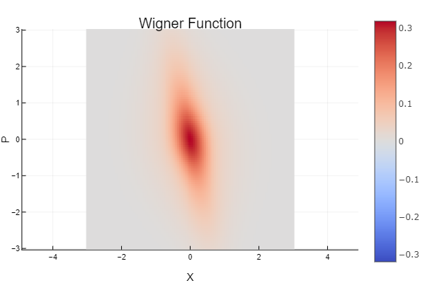
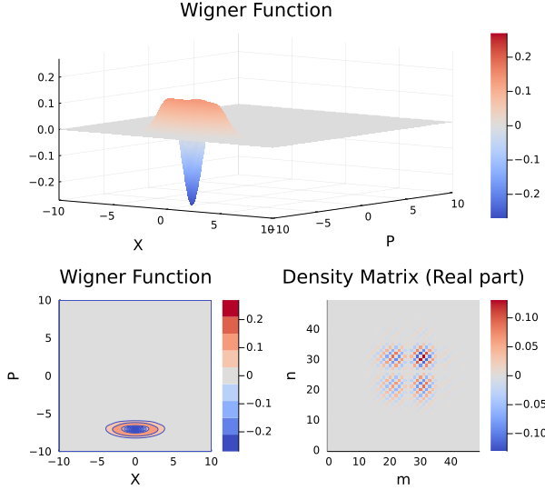

<script id="MathJax-script" async src="https://cdn.jsdelivr.net/npm/mathjax@3/es5/tex-mml-chtml.js"></script>

## Source code status

[](https://foldfelis-qo.github.io/QuantumStatePlots.jl/stable)
[](https://foldfelis-qo.github.io/QuantumStatePlots.jl/dev)
[](https://github.com/foldfelis-QO/QuantumStatePlots.jl/actions/workflows/CI.yml)
[](https://codecov.io/gh/foldfelis-QO/QuantumStatePlots.jl)

## Render Wigner function

Based on the definition of Wigner function in Fock basis:

$$
W_{mn}(x, p) = \frac{1}{2\pi} \int_{-\infty}^{\infty} dy \, e^{-ipy/h} \psi_m^*(x+\frac{y}{2}) \psi_n(x-\frac{y}{2})
$$

Owing to the fact that the Moyal function is a generalized Wigner function. We can therefore implies that

$$
W(x, p) = \sum_{m, n} \rho_{m, n} W_{m, n}(x, p)
$$

Here, the density matrix of the quantum state defined as:

$$
\rho = \sum_{m, n, i} \, p_i \, | n \rangle \langle n | \hat{\rho}_i | m \rangle \langle m |
$$

$$
\hat{\rho}_i = | \psi_i \rangle \langle \psi_i |
$$

$$
\hat{\rho}_i \, \text{is a density operator of pure state.}
$$

And the generalized Wigner function:

$$
W_{m, n} = \{ \begin{array}{rcl}
\frac{1}{\pi} exp[-(x^2 + y^2)] (-1)^m  \sqrt{2^{n-m} \frac{m!}{n!}} (x-ip)^{n-m} L_m^{n-m} (2x^2 + 2p^2), \, n \geq m \\
\frac{1}{\pi} exp[-(x^2 + y^2)] (-1)^n  \sqrt{2^{m-n} \frac{n!}{m!}} (x+ip)^{m-n} L_n^{m-n} (2x^2 + 2p^2), \, n < m \\
\end{array}
$$

### Example

The quantum state:

$$
| \psi \rangle = \hat{D}(\alpha) \hat{S}(\xi) | 1 \rangle
$$

with

$$\alpha = 5 \times exp(-i \frac{3\pi}{4})$$

$$\xi = 0.6 \times exp(-i \pi)$$

```julia
using QuantumStateBase
using QuantumStatePlots

state = displace!(squeeze!(SinglePhotonState(), ξ(0.6, 1π)), α(5., 3π/2))
wf = WignerFunction(-10:0.1:10, -10:0.1:10)

plot_wigner(wf(state), Heatmap) # Wigner function in `Heatmap` representation
plot_all(wf(state), state) # summery plot
```

#### Result

* **Wigner function in `Heatmap` representation**



* **Summery plot**



### Reference

* [Quantum mechanics as a statistical theory](https://doi.org/10.1017/S0305004100000487)
